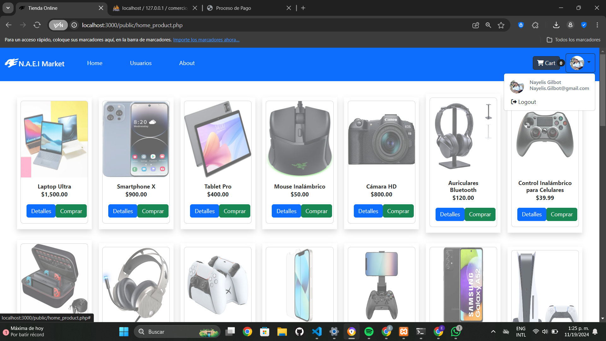
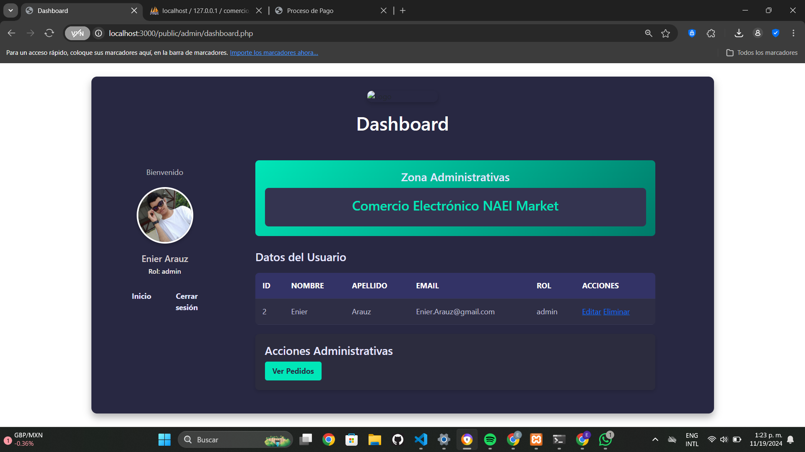
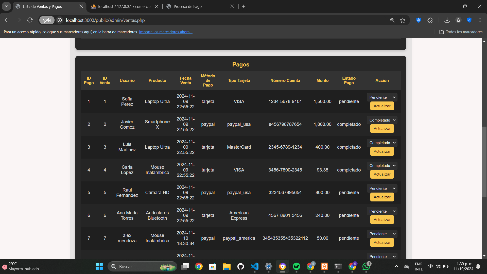

#Proyecto-Final-Universidad-Autonoma-de-Chiriqui
 
# tienda-online"
Proyecto de base de datos relacional para la gestión de una tienda en línea, desarrollado como parte del curso [Base de Datos].

# Descripcion
Como parte del desarrollo de competencias en gestión de bases de datos,
hemos creado el proyecto NAEI Market , una simulación de empresa que
refleja los principios de diseño, implementación y administración de
sistemas de información en el ámbito del comercio electrónico. Este
proyecto es el resultado del esfuerzo colaborativo de Nayelis Gilbot , Abdiel
Montezuma , Enier Araúz , e Imanol Aparicio , quienes aportaron sus
habilidades técnicas y creativas.

# Objetivo general
Diseñar e implementar un sistema de gestión de bases de datos para
NAEI Market , enfocado en la administración de productos tecnológicos,
clientes y ventas, garantizando seguridad y eficiencia. 

# Objetivos en Ganancia, Crecimiento y Rentabilidad

**Objetivo en Ganancia:**  
Maximizar los ingresos netos mediante la optimización de los márgenes de venta y la reducción de costos operativos, asegurando la sostenibilidad financiera del negocio.

**Objetivo en Crecimiento:**  
Expandir la base de clientes y aumentar la presencia en el mercado nacional, incorporando nuevos productos y servicios tecnológicos, así como alianzas estratégicas para llegar a más segmentos.

**Objetivo en Rentabilidad:**  
Lograr una rentabilidad sostenida a través de la eficiencia operativa, la fidelización de clientes y la diversificación de fuentes de ingreso, garantizando retornos atractivos para los inversionistas y la reinversión en innovación.
# OBJETIVOS ESPECÍFICOS

*   Desarrollar una base de datos relacional que integra los
    módulos principales: productos, categorías, clientes, ventas y
    pagos.
*   Cree interfaces funcionales que permitan la interacción
    amigable de los usuarios con el sistema.
*   Establecer medidas de seguridad para proteger la información
    y definir roles de acceso.
*   Documentar y presentar los resultados como un ejemplo
    práctico de gestión empresarial mediante tecnología.

# Misión  NAEI MARKET

En NAEI MARKET, democratizamos la tecnología ofreciendo productos innovadores y soluciones digitales accesibles. Nos comprometemos a brindar una experiencia de compra personalizada, segura y sin complicaciones, donde cada cliente se sienta asesorado y valorado. A través de un servicio excepcional y conocimiento especializado, convertimos necesidades tecnológicas en experiencias satisfactorias.

# Visión de NAEI MARKET

Soñamos con ser tu aliado tecnológico de confianza, donde encuentres más que productos: soluciones que transformen tu vida. Nos eligen por nuestra amplia variedad, transparencia absoluta y el trato humano que nos diferencia. Queremos que cada experiencia con nosotros sea fácil, personalizada y llena de posibilidades. En NAEI, creemos en innovar con propósito y conectar con el corazón. Construimos un futuro digital más inclusivo y sostenible. 

# FODA

# CANVA 
# Puntos Clave del Negocio

# cual seria la ventaja competitiva de su proyecto virtual o negocio digital

NAEI MARKET se distingue en el competitivo mercado del e-commerce tecnológico a través de una combinación única de valor emocional, accesibilidad y propósito, que se traduce en las siguientes ventajas clave:  

1. Tecnología con Propósito + Experiencia Humana  
 -Diferenciador: No solo vendemos productos, sino soluciones que mejoran vidas (estudios, trabajo, hogar) con un enfoque en inclusión digital y sostenibilidad.  
 -Impacto: La marca conecta emocionalmente al comunicar innovación con el corazón (ej: asesoría personalizada, contenido educativo, compromiso social).  

2. Democratización de la Tecnología
 -Precios competitivos y planes flexibles (ej: financiación, suscripciones) para llegar a públicos diversos, incluidos aquellos con menor acceso.  
-Inventario adaptado a necesidades reales (desde estudiantes hasta profesionales), con filtros de búsqueda inteligentes y kits de soluciones.  

3. Servicio Excepcional y Personalización 
 -Asesoría especializada en vivo (chat/video) para guiar al cliente, diferenciándose de la frialdad de los marketplaces tradicionales.  
-Posventa con calidez: Soporte técnico rápido, comunidad de usuarios y recompensas por lealtad.  

4. Transparencia y Confianza
Reviews verificadas y comparativas honestas* de productos, evitando la sobrecarga de opciones típicas de Amazon o Mercado Libre.  
- Logística sostenible: Envíos carbono-neutral o opciones de retorno fácil, alineados con valores eco-friendly.  

 5. Impacto Local y Sostenible  
   Generación de empleo local en servicio al cliente y logística, reforzando la economía comunitaria.  
 - Alianzas con startups regionales  para ofrecer tecnología emergente con impacto social.  

¿Por qué elegir NAEI MARKET frente a otros? 
Mientras los competidores se enfocan en precio o variedad, NAEI ofrece un ecosistema tecnológico accesible, humano y con propósito, donde el cliente se siente parte de una comunidad, no solo un comprador.  

Ejemplo tangible: Un estudiante encuentra en NAEI un paquete "Todo en Uno" (laptop + software educativo + tutorías digitales) con financiación a medida, algo que grandes plataformas no personal

# explique los bloques formativo de las ventajas competitiva de su negocio digital

1. PROPÓSITO CON CREDIBILIDAD 
- Tecnología con impacto social verificable (ej: por cada compra, horas de capacitación digital donadas)  
- Comunicación transparente con certificaciones de sostenibilidad  

2. ACCESO SIN BARRERAS  
   - Financiamiento flexible: microcréditos y planes "Prueba-Antes-de-Comprar"  
   - Logística adaptada: entrega en 24h en zonas urbanas, puntos de retiro rurales. 

3. EXPERIENCIA QUE ENGANCHA  
   - Recompensas por uso frecuente (ej: descuentos por tiempo de uso del producto)  

4. INNOVACIÓN CON DATA REAL 
   - Rotación inteligente de inventario basada en tendencias locales  

Diferencial Único:  
La fusión de sostenibilidad con practicidad, donde cada innovación tecnológica está ligada a un beneficio social cuantificable, creando lealtad racional y emocional.  

# cómo aplicaría la eficiencia, calidad, innovación, capacidad de satisfacer al cliente en su negocio digital

1. EFICIENCIA
- Logística inteligente: Sistema de inventario automatizado con alertas de reposición y rutas de entrega optimizadas por IA.  
- Procesos ágiles: Checkout en 3 pasos con pagos predeterminados para clientes recurrentes.  

2. CALIDAD
-  Selección rigurosa de productos con pruebas de durabilidad y rendimiento antes de incluirlos en el catálogo.  
- Garantía extendida: Soporte técnico gratuito por 1 año en todos los productos.  

3. INNOVACIÓN 
- Realidad Aumentada: Probador virtual para ver cómo los dispositivos se integran en tu espacio de trabajo/hogar.  
 - ": Suscripción para actualizar dispositivos cada 2 años sin costo adicional.  

4. SATISFACCIÓN DEL CLIENTE  
 - Asesoría 24/7: Conexión directa con expertos vía chat o video llamada.  
 - Política : Devoluciones en 15 días con reembolso inmediato. 

# cuales serian las habilidades distintivas, recursos y capacidades para su negocio digital

NAEI MARKET: Habilidades, Recursos y Capacidades Clave  

Habilidades Únicas  
–Ojo experto para elegir productos innovadores + sostenibles. 
-Filtral lo útil : productos basados en tiempo real.

Recursos Clave  
– E-commerce + app + soporte integrados.  
– Guías y tutoriales actualizados por expertos.  

Capacidades Estratégicas 
 – entrega rápida y devoluciones confiables 
- Innovación rápida – Lanzar mejoras en 30 días usando feedback directo.

# Características Principales
Catálogo de productos: Gestión de productos, detalles, categorías y variantes.
Gestión de clientes: Registro, perfil y historial de compras.
Proceso de compra: Carrito de compras, pagos seguros y seguimiento de pedidos. 
Panel de administración: Gestión de productos, usuarios y pedidos.
Roles de usuario: Administrador, cliente, empleado, contador.
Interfaz de usuario intuitiva: Diseñada para facilitar la navegación y la compra.

# Tecnologías Utilizadas
Base de datos:  [MySQL]
Lenguaje de programación: [PHP]
Framework: [Boostrap]
Frontend: [HTML], [CSS], [JavaScript]

Estructura del Proyecto
Base de datos: Diagrama ER y scripts de creación de tablas.
Backend: Código fuente del servidor, controladores y modelos.
Frontend: Código fuente de la interfaz de usuario.
Documentación: Documentación técnica y de usuario.

